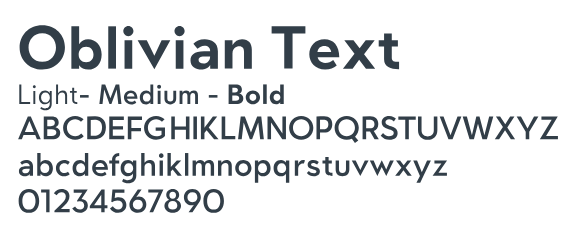
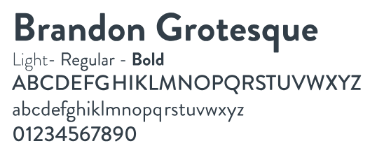
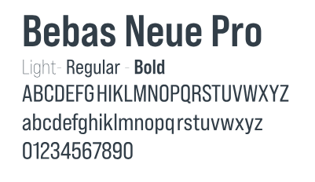
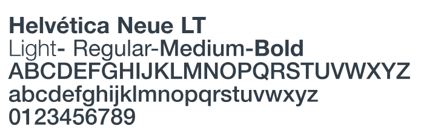

# Kalkulilo

**_Kˌalkulˈilo_**: "Calculator" in Esperanto.

## Inspiration

- [Manual Normas Graficas FING 2024](https://www.fing.usach.cl/sites/ingenieria/files/paginas/manual_de_normas_graficas_fing_2023.pdf)
## Primary Colors

- PANTONE ® 3272 C (#00A499):

 

-  PANTONE ® 716 C (#EA7600):

 

- PANTONE ® 432 C (#394049):

 

## Complementary Colors

- PANTONE ® 258 C (#8C4799):

 

- PANTONE ® 279 C (#498BCA):

 

- PANTONE ® 124 C (#EAAA00):

 

- PANTONE ® 186 C (#C8102E):

 

## Main Fonts

## Complementary Fonts

